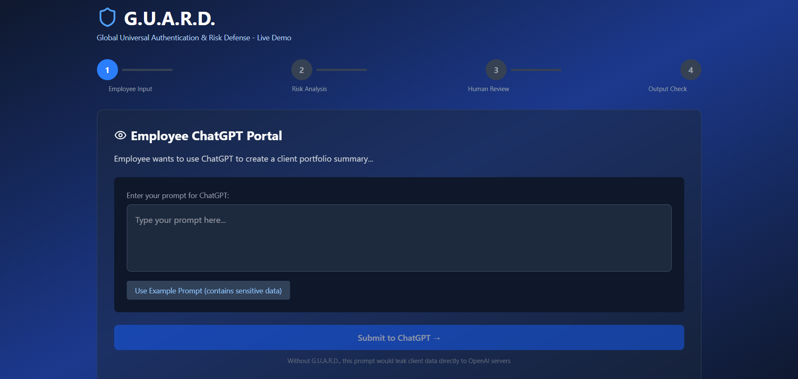
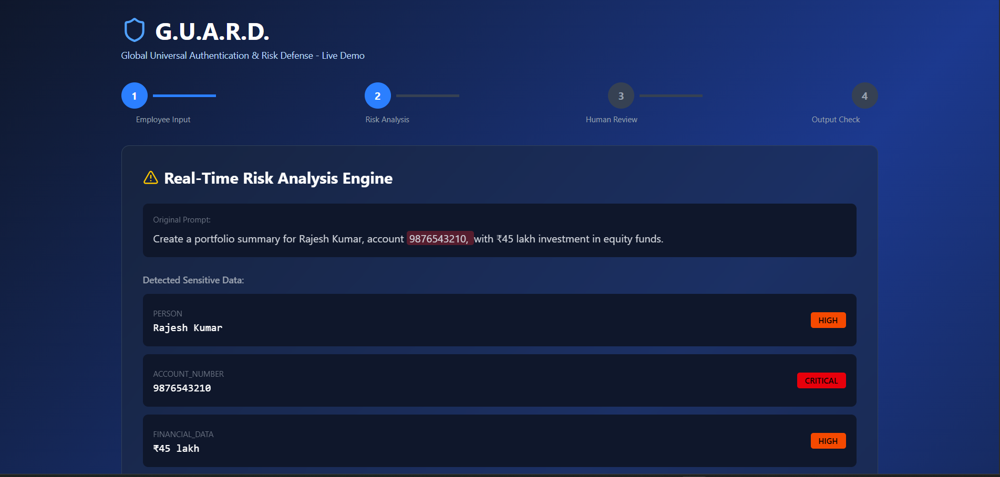
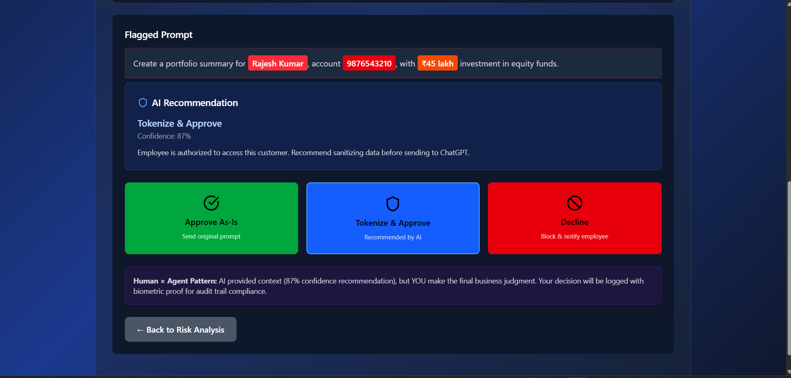
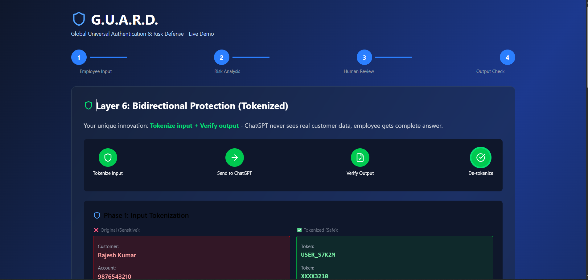

# G.U.A.R.D. — Global Universal Authentication & Risk Defense

An interactive live demo showcasing AI-powered data protection for enterprise banking. G.U.A.R.D. intercepts employee prompts before they reach external AI services like ChatGPT, scans for sensitive customer data, and enforces adaptive security policies.

---

## 📸 Screenshots





| Screen | Description |
|--------|-------------|
| Employee Portal | Employee enters a ChatGPT prompt |
| Risk Analysis Engine | Real-time PII detection + risk scoring |
| Human Review Console | Security officer reviews and decides |
| Output Verification | Bidirectional tokenization + AI response |

---

## What It Demonstrates

- **Real-time PII detection** — names, account numbers, financial amounts, emails, card numbers
- **Adaptive risk scoring** — Low / Medium / High, each triggering a different policy
- **Human-in-the-loop review** with biometric verification simulation
- **Bidirectional protection** — tokenize input before AI, verify and de-tokenize output after
- **Audit trail** with cryptographic proof of officer decisions

---

## How It Works — 4 Screens

### Screen 1 — Employee Portal
The employee types a prompt intended for ChatGPT. G.U.A.R.D. intercepts it before it leaves the organization.

### Screen 2 — Real-Time Risk Analysis Engine
The prompt is scanned using pattern matching and ML risk scoring across 6 weighted factors:

| Factor | Weight |
|--------|--------|
| Data Sensitivity | 40% |
| Employee Authorization | 25% |
| Data Volume | 15% |
| Platform Risk | 10% |
| Time / Location | 5% |
| History | 5% |

**Risk Tiers & Actions:**
- **Low Risk (< 30)** → Auto-Approve, proceed directly to output
- **Medium Risk (30–69)** → Human Review with AI suggestion to approve
- **High Risk (≥ 70)** → Block, mandatory Human Review

### Screen 3 — Human Review Console
A security officer reviews the flagged prompt with full context:
- Employee details and authorization status
- AI recommendation with confidence score (varies by risk tier)
- Three decisions: **Approve As-Is**, **Tokenize & Approve**, **Decline**
- Biometric (fingerprint) verification required

### Screen 4 — Output Verification
G.U.A.R.D.'s core innovation — protection in both directions:

1. **Tokenize Input** — Replace PII with session tokens before sending to AI
2. **AI Processes** — ChatGPT never sees real customer data
3. **Verify Output** — Hallucination detection, harmful content scan, data leak check
4. **De-tokenize** — Real values restored for the employee's final response

---

## Tech Stack

| Layer | Technology |
|-------|-----------|
| Frontend | React 19 + Vite 8 |
| Styling | Tailwind CSS v4 |
| Icons | Lucide React |
| Language | JavaScript (JSX) |

---

## Project Structure

```
guard-demo/
├── src/
│   ├── components/
│   │   ├── Header.jsx              # App title and branding
│   │   ├── ProgressBar.jsx         # 4-step navigation indicator
│   │   ├── EmployeePortal.jsx      # Screen 1 — prompt input
│   │   ├── RiskAnalysis.jsx        # Screen 2 — PII detection + scoring
│   │   ├── HumanReview.jsx         # Screen 3 — officer review console
│   │   ├── OutputVerification.jsx  # Screen 4 — tokenize/verify/de-tokenize
│   │   └── Button.jsx              # Reusable button component
│   ├── App.jsx                     # Root + state management
│   ├── main.jsx                    # React entry point
│   └── index.css                   # Tailwind + custom animations
├── .env                            # API keys (not committed)
├── vite.config.js
└── package.json
```

---

## Getting Started

### Prerequisites
- Node.js 18+
- npm

### Installation

```bash
# Clone the repository
git clone <repo-url>
cd guard-demo

# Install dependencies
npm install

# Start development server
npm run dev
```

Open [http://localhost:5173](http://localhost:5173) in your browser.

### Build for Production

```bash
npm run build
npm run preview
```

---

## Demo Walkthrough

1. Click **"Use Example Prompt"** — pre-fills a prompt with real customer PII
2. Click **"Submit to ChatGPT →"** — G.U.A.R.D. intercepts and scans
3. Watch the **Risk Score animate** to 90/100 (HIGH RISK) with entities highlighted
4. Click **"Proceed to Human Review"**
5. Select **"Tokenize & Approve"** → verify with fingerprint
6. Watch the **4-phase pipeline** — tokens sent to AI, output verified, real names restored

---

## Key Innovation vs. Competitors

| Feature | Nightfall | Purview | Zscaler | **G.U.A.R.D.** |
|---------|-----------|---------|---------|----------------|
| Input scanning | ✅ | ✅ | ✅ | ✅ |
| Output verification | ❌ | ❌ | ❌ | ✅ |
| Bidirectional tokenization | ❌ | ❌ | ❌ | ✅ |
| Human-in-the-loop | ❌ | Partial | ❌ | ✅ |
| Biometric audit trail | ❌ | ❌ | ❌ | ✅ |

---

## Environment Variables

Create a `.env` file in the project root:

```env
VITE_GEMINI_API_KEY=your_google_ai_studio_key
```

Get a free key at [aistudio.google.com](https://aistudio.google.com) → Default Gemini Project.

> The app works fully without an API key — falls back to contextual template responses.

---

## License

Built for Deloitte demo purposes.

- [@vitejs/plugin-react](https://github.com/vitejs/vite-plugin-react/blob/main/packages/plugin-react) uses [Oxc](https://oxc.rs)
- [@vitejs/plugin-react-swc](https://github.com/vitejs/vite-plugin-react/blob/main/packages/plugin-react-swc) uses [SWC](https://swc.rs/)

## React Compiler

The React Compiler is not enabled on this template because of its impact on dev & build performances. To add it, see [this documentation](https://react.dev/learn/react-compiler/installation).

## Expanding the ESLint configuration

If you are developing a production application, we recommend using TypeScript with type-aware lint rules enabled. Check out the [TS template](https://github.com/vitejs/vite/tree/main/packages/create-vite/template-react-ts) for information on how to integrate TypeScript and [`typescript-eslint`](https://typescript-eslint.io) in your project.
